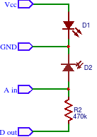

# IR Barrier Sensor for Arduino with LED turned for measurements only
Barrier/distance IR sensor Arduino library  working with lightness changes

 - **Can`t calibrate if lightness changes very fast * ([look below](#-fast-ligtness-changes-problem))**<br/>
 - Sensivity reduction on sun lightness<br/>
 - Measure with dalay only (default is 1 ms)<br/>
 + Use sensor calibration to ignore lightness changes<br/>
 + Use less power<br/>
 + High sensivity (70mm at evening lights)<br/>
 + Can detect black objects (30mm at evening lights)<br/>
 + Can use getRaw() to check how far barrier is (slow down robot moving to stay closer to barrier and avoid collapse)

For work without delay use <a href="https://github.com/el-fuego/IRBarrierSensor">IRBarrierSensor</a>

#### Circuit 


Vcc is +5V<br>
Decrease measurement time for hight voltage and increase for low

#### Algorithm
1. Measure sensor values with LED turned OFF and ON
2. Calibrate sensors on robot power ON (store current sensors values)
4. Barrier is detected when calibrated and current values with LED turned ON deviation is more than limit
5. Calibrate sensor if don`t have barrier and old calibrated and current values with LED turned OFF is more than limit

#### * Fast ligtness changes problem
Can`t catch calibration, when moving from darkness to lightness is very fast, for example, your robot turns around<br/>

You can **use senfor screening** from daylights for this and sensivity problem

```
   black         sun rays
   screen        / / / / /
------------------/     /
sensor=)        \/     /
------------------ \  /
___ground___________\/__
```
